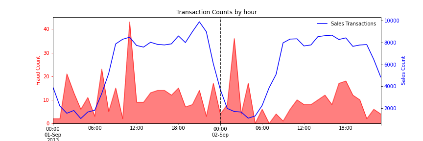

# Fraud Detection Model Planning

Managing the costs associated with credit card fraud is critical for merchant success. A precision-recall balance must be maintained between identifying and addressing fruad and limiting the impact on legitimate customers. This project focuses on the planning steps for creating a credit card fraud detection model that can be utilized by merchants to identify fraud and determine this balance.

The dataset used in the project contains transactions made by credit cards in September 2013 by european cardholders over a two day period of time. It contains 492 fraudulent transactions out of 284,807 total transactions. The dataset is highly unbalanced, the positive class (frauds) account for 0.172% of all transactions. The dataset includes 28 potential fraud prediction features which have been anomynized through a PCA dimensionality reduction transformation in order to maintain confidentiality of the data. 

This project has three goals:
1.  Determine if multiple models are needed for detecting different variations of fraud.
2.  Identify features that are most likely to influence a fraud detection model.
3.  Estimate if training a model on Day 1 data will be sufficient for detecting fraud on Day2.

 